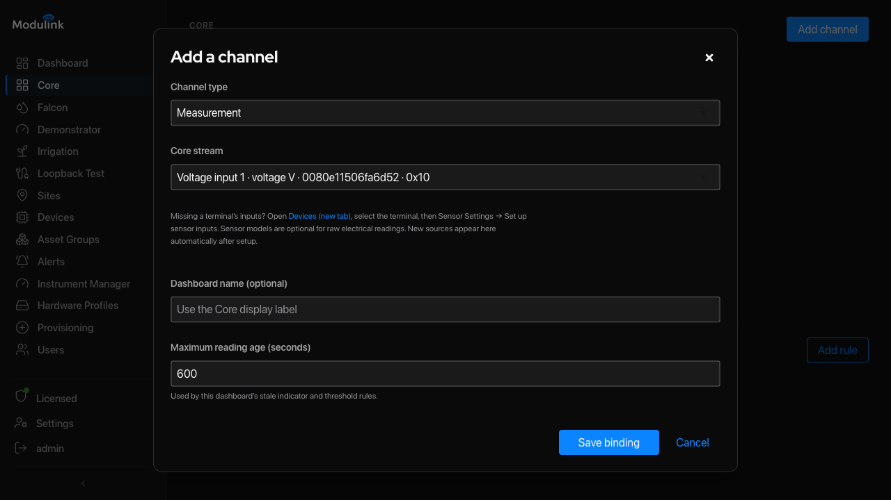
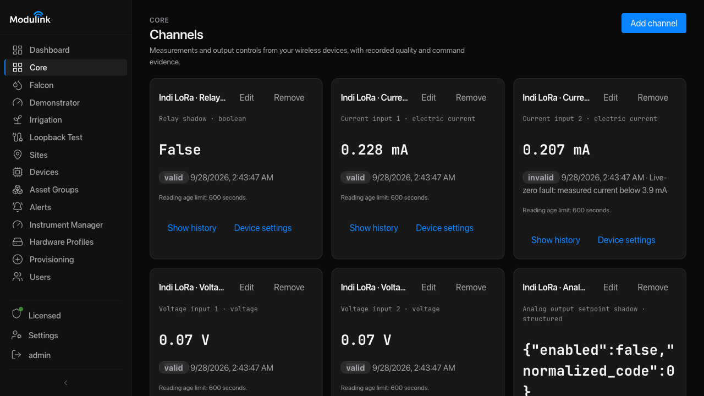

# Configure Sensors and Check Readings

Read current in mA or voltage in V when those units meet your needs. Use this
workflow to add readings to Core and, when needed, map a sensor signal to a
real-world measurement such as pressure.

## Steps

1. **Confirm the terminal.** Open **Devices** and select the terminal.
   **Expected:** its identity and latest report are visible. Continue only when
   this is the terminal connected to the sensors.

2. **Set up its sensor inputs.** Open **Sensor Settings** and select
   **Set up sensor inputs** when it is available. **Expected:** the terminal's
   supported inputs are listed. Agri provides three native
   Watermark resistance inputs, a DS18B20 temperature input, and diagnostic
   streams. Indi LoRa provides two current inputs, two voltage inputs, and
   output-state streams. A missing reading is not a reason to add a replacement
   channel; first check the terminal, input, and latest report.

3. **Register each supported source in Core.** For one source, open **Core →
   Channels → Add channel**, select its **Measurement** and **Core stream**, and
   select **Save binding**. Repeat for each supported source. For an output,
   select **Actuator** and its **Core endpoint**. Register its reported state
   as a separate channel. **Expected:** each saved channel appears in Core. A
   state channel does not send a command.

   

   This example adds a raw voltage reading. Check that the selected source
   belongs to your terminal. Then select **Save binding**.

   <a href="https://sobtienterprises.github.io/modulink-public-docs/assets/screenshots/core-add-voltage-channel.png" target="_blank" rel="noopener">Open full-size image</a>

4. **Map an analog input when you need a real-world measurement.** Open
   **Devices → Sensor Settings → Map sensors to inputs**. Select the matching **Sensor
   model** and check its measurement and signal ranges. Some models provide
   signal endpoints. If the form asks for **Signal minimum** and **Signal
   maximum**, enter the transmitter's configured endpoints in mA or V. Use a
   current input for a current transmitter and a voltage input for a voltage
   transmitter. Select **Save sensor mapping**. **Expected:** the form confirms
   whether Core is using the mapping. Read the message after saving.

5. **Check the result.** Wait for a fresh report. **Expected:** a recent reading
   appears with its timestamp and quality. Compare the reading with the
   instrument's configured range and an independent reference before using it.
   For Agri, follow
   [Set Up Agri Irrigation](set-up-agri-irrigation.md) to configure the
   Watermark models and temperature compensation before registering the
   derived soil-tension streams.

## Indi LoRa current readings

Native Indi LoRa current inputs report raw current from 0–20 mA. A sensor
model can scale a 4–20 mA signal to a real-world measurement without changing
that raw reading. Per-channel **live-zero fault detection** is off by default.
When enabled, a reading below 3.9 mA is marked as a fault, and the measured
current remains visible.

### Set live-zero fault detection

1. Open **Devices** and select the Indi LoRa terminal.
2. Open **Sensor Settings**. Find the current input that you want to change.
3. Select **Enable live-zero fault detection for this input** only when the
   connected transmitter uses a 4–20 mA signal. Leave it off for an unused
   input or a sensor that uses the full 0–20 mA range.
4. Select **Save live-zero setting** for that input.
5. Open **Core** and wait for a new reading. If live-zero is on and current is
   below 3.9 mA, the channel shows **invalid** and a **Live-zero fault** message.
   The current value stays visible. Check the sensor supply and wiring.
6. To turn the check off, clear the same checkbox and save. Wait for a new
   reading. The live-zero fault clears if no other fault is present.

In this example, live-zero is off for input 1 and on for input 2. Both inputs
show their measured current. These are example readings from unconnected
inputs, not calibration targets.

<a href="https://sobtienterprises.github.io/modulink-public-docs/assets/screenshots/core-current-live-zero.png" target="_blank" rel="noopener">Open full-size image</a>

For older ADC-based hardware, follow the [Legacy Sensor Calibration
Reference](../reference/legacy-sensor-calibration.md). Do not use its ADC
counts as current or voltage values in Core.

Last reviewed: 2026-09-28.
