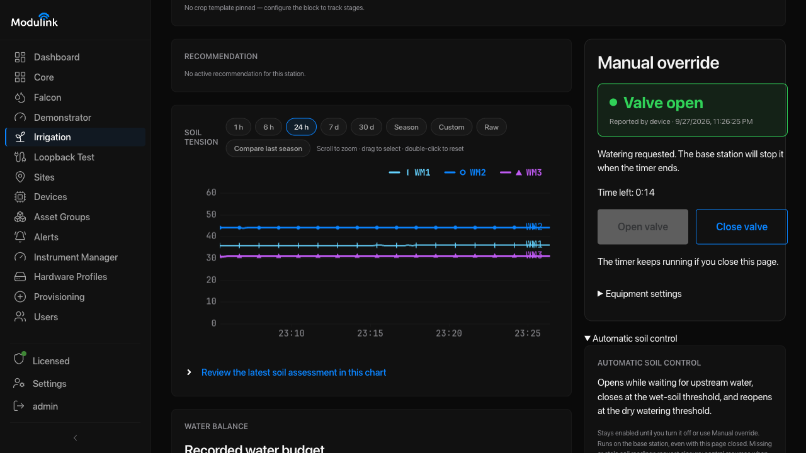
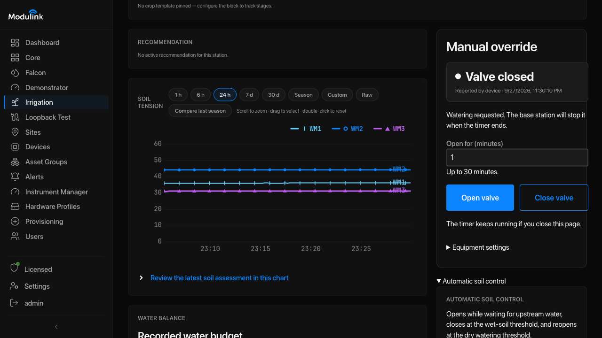
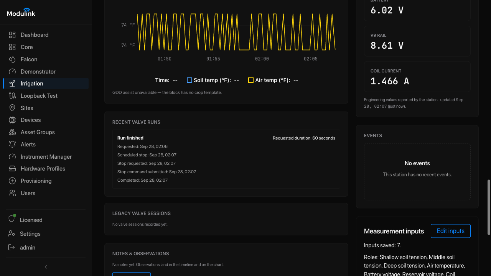

# Operate Irrigation

Use these steps after completing [Agri Irrigation setup](set-up-agri-irrigation.md)
and confirming the site's valve procedure.

## Steps

1. **Open the station.** Select **Irrigation → My Zones**, then select
   **Review finite control** for the station.
   **Expected:** the station page opens with its readings and controls.

2. **Check the station readings.** Review soil tension, temperature, battery,
   terminal diagnostics, alerts, timestamps, reading quality, and the valve
   state last reported by the terminal. Confirm that the readings are fresh
   before you act. Inspect the field if a reading is unexpected or a sensor
   fault appears.
   **Expected:** the readings and reported state are current and understood.

3. **Enter an approved duration.** Under **Manual override**, enter the
   duration approved by the site's valve procedure in **Open for (minutes)**.
   **Expected:** the requested duration appears in the field.

4. **Open the valve.** Select **Open valve** once.
   **Expected:** the application shows a countdown. Wait for a fresh **Open**
   report. A command result or reported valve state does not prove that water
   is flowing.

   

   <a href="https://sobtienterprises.github.io/modulink-public-docs/assets/screenshots/agri-finite-manual-open-countdown.png" target="_blank" rel="noopener">Open full-size image</a>

   *The countdown continues while the valve is open. Use Close valve to stop early.*

5. **Wait for the timer.** When the countdown ends, the application shows
   **Waiting for the valve to close…** Wait for a fresh **Closed** report.
   Timer expiry alone does not confirm that the valve closed.

   

   <a href="https://sobtienterprises.github.io/modulink-public-docs/assets/screenshots/agri-finite-manual-closed.png" target="_blank" rel="noopener">Open full-size image</a>

   *Check the report time as well as the valve state.*

6. **Review the run record.** On the same station page, find **Recent valve
   runs**. Check the requested duration, scheduled stop, and completion time.
   **Expected:** the completed entry shows **Run finished**. The record stays
   available when you leave the page and return.

   

   <a href="https://sobtienterprises.github.io/modulink-public-docs/assets/screenshots/agri-finite-run-history.png" target="_blank" rel="noopener">Open full-size image</a>

   *These times describe the timer and stop requests. The record does not prove
   valve movement or water flow. Also check the fresh Closed device report.*

To stop early, select **Close valve**, then wait for a fresh **Closed** report.
The timer continues if you close the browser. Keep the Basestation powered so
it can send the close command. If communication fails, use the site's
independent closure procedure.

Verify the physical result when the site procedure requires it. Check the
station state and alerts before another operation. A reported valve state
does not prove that water is flowing.

Last reviewed: 2026-09-28.
