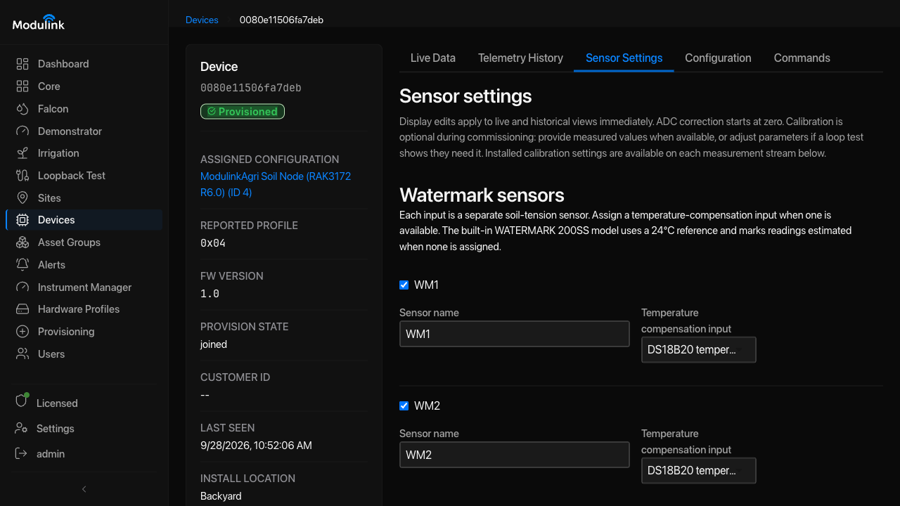
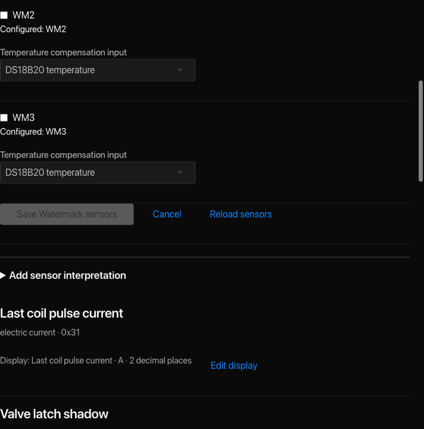
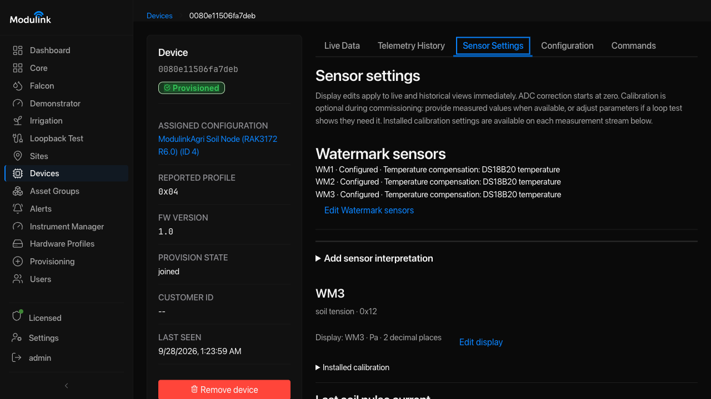
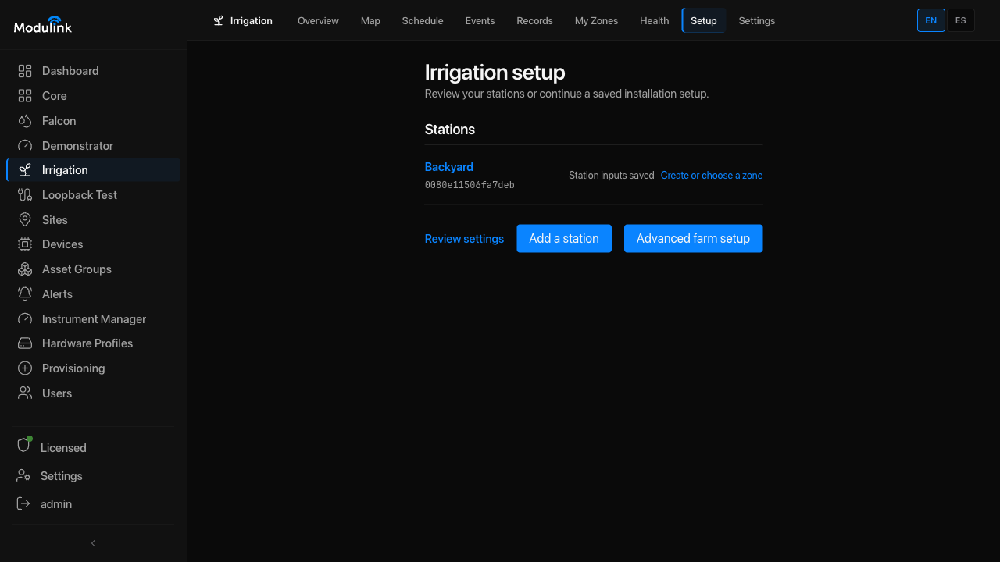
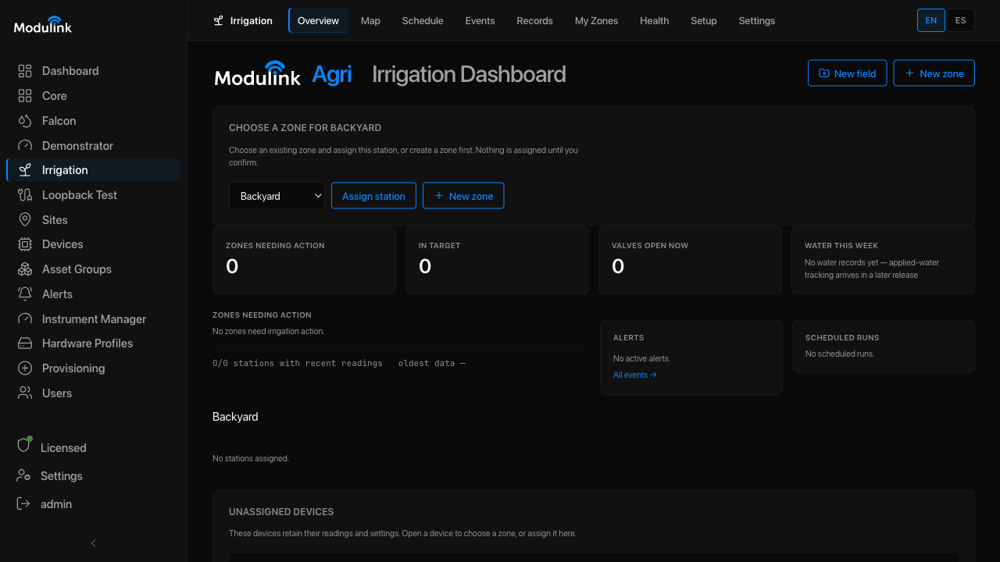
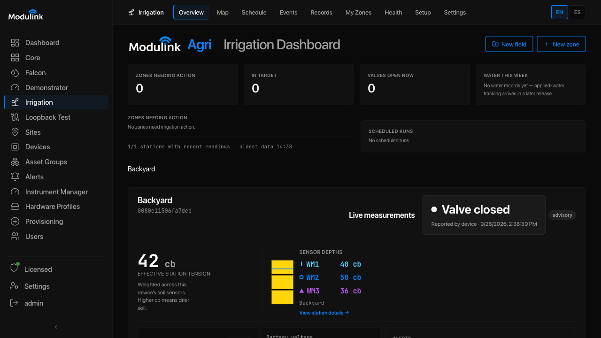
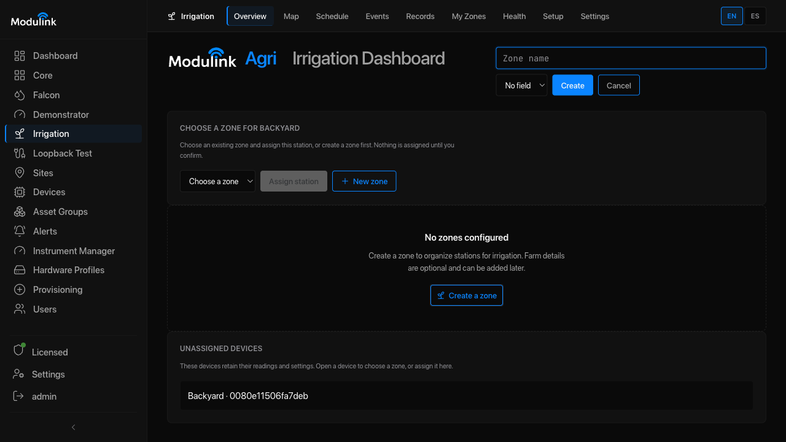

# Set Up Agri Irrigation

Use this workflow to prepare an Agri station for monitoring. It does not open a
valve or start automatic control.

## Steps

1. **Set up the Agri inputs.** Open **Devices**, select the Agri terminal, open
   **Sensor Settings**, and select **Set up sensor inputs**. The terminal
   provides three Watermark resistance inputs, one DS18B20 temperature input,
   and diagnostic streams such as battery, reservoir-rail, and coil-pulse
   current. If no Agri terminal is offered, check its profile, firmware, and
   latest report in **Devices**. Return to **Irrigation → Setup** and select
   **Check again**.

2. **Select the Watermark and temperature inputs.** Open **Devices**, select
   the Agri terminal, and open **Sensor Settings**. If the Watermark settings
   are already saved, select **Edit Watermark sensors**.
   Configure WM1, WM2, and WM3 as separate soil-tension sensors. For this Agri
   terminal, the form selects the temperature input on port **0x13** when
   exactly one matching stream is available. Check that each Watermark uses
   the DS18B20 input before saving. Temperature compensation uses temperature
   to improve the soil-tension calculation. This choice does not change where
   the DS18B20 is physically installed. If the input is missing or unclear,
   choose the correct source before saving.

   

   <a href="https://sobtienterprises.github.io/modulink-public-docs/assets/screenshots/agri-watermark-default-ds18b20.png" target="_blank" rel="noopener">Open full-size image</a>

   *The form selects the onboard DS18B20 when it is the only temperature input on that terminal. Check all three rows, then save. The next image shows the lower part of the form.*

   

   <a href="https://sobtienterprises.github.io/modulink-public-docs/assets/screenshots/agri-watermark-compensation-lower.png" target="_blank" rel="noopener">Open full-size image</a>

3. **Save and check the sensor setup.** Select **Save Watermark sensors**.
   The form closes and the page shows a summary for WM1, WM2, and WM3, with
   their temperature compensation settings. Use **Edit Watermark sensors**
   when you want to change those settings.

   

   <a href="https://sobtienterprises.github.io/modulink-public-docs/assets/screenshots/agri-watermark-saved-summary.png" target="_blank" rel="noopener">Open full-size image</a>

4. **Review estimated readings and corrections.** Without a selected
   temperature input, the built-in WATERMARK 200SS calculation uses a 24 °C
   reference, so its soil-tension result is marked **Estimated**. Estimated
   means the value uses a reference in place of a temperature measurement.
   New Irrigation inputs accept estimated readings by default. Keep this
   setting unless the site requires a different policy. Keep any existing
   choice to reject estimated readings.

   ADC correction starts at **0**. Leave it at 0 unless a measured check and
   the site's limits show a correction is needed. Calibration is optional. If
   you calibrate, use measured values and the site's acceptance limits.

5. **Register the Agri sources in Core.** Open **Core → Channels** and use the
   Agri checklist in [Register and Commission a Terminal](commission-a-terminal.md).
   Register every supported source, the three derived soil-tension streams,
   and the valve endpoint before choosing station inputs. The simple station
   setup uses seven measurement inputs: three derived tensions, one
   temperature role, and three diagnostics.

6. **Review and save the station.** Open **Irrigation setup**. Under **Set up
   an Agri station**, select the terminal and enter a station name. Set
   **Temperature sensor measures** to **Air temperature** or **Soil
   temperature** to match the DS18B20's physical location. Select the normally
   open or normally closed valve type from the approved installation record.
   Review the seven inputs and suggested Core measurements, then select **Save
   reviewed station**. The station list shows **Station inputs saved**. Select
   the station name to open it. If an existing station is unassigned, select
   **Review and resume station** and check its saved settings before changing
   them. If the station already belongs to a zone, open it to review its saved
   settings.

   

   <a href="https://sobtienterprises.github.io/modulink-public-docs/assets/screenshots/agri-station-saved-setup.png" target="_blank" rel="noopener">Open full-size image</a>

7. **Put the station in a zone.** Under **Create or choose a zone**, select an
   existing zone, or select **New zone** and enter a name. If you do not know
   the field, choose **No field**. You can add a field later. Select the new
   zone, then select **Assign station**. The choice panel closes after the
   assignment is saved. Check
   that the station appears under the zone. Choosing or creating a zone does
   not assign the station, and assignment does not open the valve.

   **Choose an existing zone**

   

   <a href="https://sobtienterprises.github.io/modulink-public-docs/assets/screenshots/agri-zone-choice.png" target="_blank" rel="noopener">Open full-size image</a>

   

   <a href="https://sobtienterprises.github.io/modulink-public-docs/assets/screenshots/agri-zone-assigned.png" target="_blank" rel="noopener">Open full-size image</a>

   **Create a new zone**

   

   <a href="https://sobtienterprises.github.io/modulink-public-docs/assets/screenshots/agri-backyard-zone-form.png" target="_blank" rel="noopener">Open full-size image</a>

   

   <a href="https://sobtienterprises.github.io/modulink-public-docs/assets/screenshots/agri-backyard-zone-selected.png" target="_blank" rel="noopener">Open full-size image</a>

   

   <a href="https://sobtienterprises.github.io/modulink-public-docs/assets/screenshots/agri-backyard-zone-assigned.png" target="_blank" rel="noopener">Open full-size image</a>

8. **Check the saved settings.** A new station starts in monitoring mode.
   **Measurement inputs** and **Station settings** show summaries. Use **Edit
   inputs**, **Edit name and location**, **Edit valve setting**, or **Change
   zone** to make a change. **Cancel** keeps the saved settings. You do not need
   to repeat setup on each visit.

   Leave unknown crop, soil, depth, and strategy values unset. **Advanced farm
   setup** currently needs an operation name before it can continue. You do not
   need Advanced farm setup to monitor this station.

9. **Check readings.** In the station, check the three soil-tension readings,
   temperature, diagnostics, timestamps, and reading quality. Confirm that the
   temperature role matches the DS18B20's physical location. This Agri terminal
   reports no more often than every 15 seconds. A shorter requested interval
   will not make readings arrive sooner. Check the last report time before
   relying on a reading.

For valve operation, follow the site's approved procedure and use a compatible
latching valve. A command or reported valve state alone does not prove that
water is flowing. See [Operate Irrigation](operate-irrigation.md).

For installation limits, see
[Self-install Readiness](../reference/self-install-gaps.md) and the
[Installation Record](../reference/installation-record.md).

Last reviewed: 2026-09-28.
