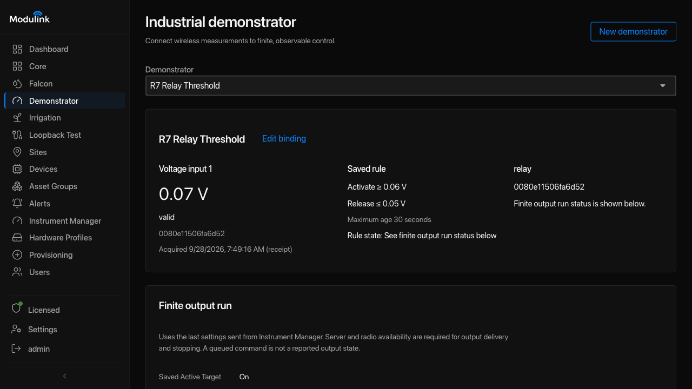
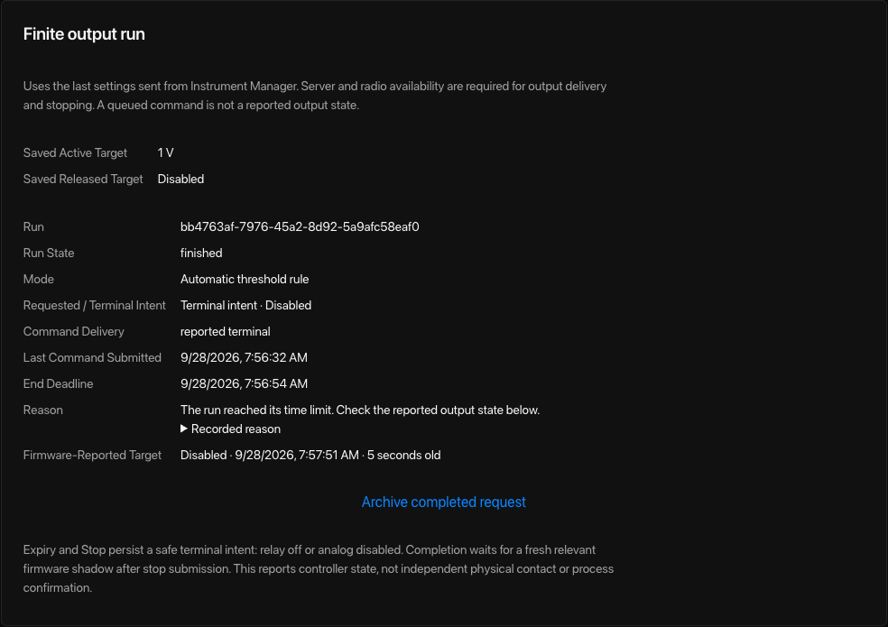

# Use the Industrial Demonstrator

Open **Demonstrator** to connect a registered measurement to an output for a
timed run. This page covers the current Indi LoRa relay and analog output path,
shown as **Application-managed finite output**. The input can be on another terminal.

## 1. Prepare the input and output

1. [Commission the terminal](commission-a-terminal.md) and register the input
   measurement and output endpoint in **Core**. A reported output-state channel
   is separate from the endpoint used to send commands.
2. Check the input's value, unit, quality, and timestamp.
3. [Configure the output](configure-instruments.md) in **Instrument Manager** or
   the device's **Configuration** tab. Save its mode and settings before binding it.

You can save a binding while the output is disabled. Enabling it and saving
settings is required before starting a run. Confirm the connected load and
agreed test procedure before enabling or operating it.

## 2. Create the demonstrator

1. Select **New demonstrator** and enter a name.
2. Choose **Input measurement** and **Threshold unit**.
3. Enter **Activate at or above** and a lower **Release at or below** value.
   Between them, the rule keeps its previous state.
4. Review **Maximum input age (seconds)** and the quality/time checkboxes.
   For this output path, the suggested age is twice the expected reporting
   interval, with a minimum of 30 seconds. Radio receipt-based timestamps need
   **Allow inferred acquisition times or unknown time precision** enabled.
5. Choose **Output endpoint**, then set **When activated** and **When released**.
   For an analog output, choose **Enable analog output** under **When activated**.
   A **Setpoint** field appears. Enter the value in the displayed unit and range.
   Choose **Disable analog output** under **When released** if the rule should
   turn the output off when the input is at or below the release threshold.
   These fields prepare the run. Changing them does not operate the output.
6. Select **Save binding**. Check that the saved input, rule, and output are correct.

   

   *Example: the saved rule connects a voltage input to a relay. Use the values
   required for your equipment; the numbers shown here are for a bench test.*

   <a href="assets/screenshots/demonstrator-saved-relay-rule.png" target="_blank" rel="noopener">Open the saved-rule image at full size</a>

The Demonstrator's **Allow measurements marked estimated** setting is separate
from Irrigation's input policy; review it for this rule. Invalid measurements
still cannot drive the automatic rule.

If output setup is incomplete, use **Open device** to review and save the output
settings. The page checks again automatically. Saving a binding alone does not
enable or operate the output.

## 3. Run and observe

1. Under **Finite output run**, choose **Automatic threshold rule** or
   **Manual active target**.
2. Enter **Run duration (seconds)** within the displayed limit.
3. Select **Start finite run**.
4. Compare **Requested / terminal intent**, **Command delivery**, and
   **Firmware-reported target**, including its timestamp. Verify the physical
   result using the agreed commissioning procedure.

   

   *Example after the time limit: the run is finished and the terminal reports
   Disabled. The report does not measure the voltage at the output terminals.*

   <a href="assets/screenshots/demonstrator-analog-finished-run.png" target="_blank" rel="noopener">Open the completed-run image at full size</a>

To end early, select **Stop and request safe output**. Expiry and Stop request
relay **Off** or analog **Disabled**, independently of the rule's released target.
Analog disabled is different from an enabled 0 V setpoint.

The Basestation and radio link must remain available to deliver commands and
stop the output. Completion waits for a fresh relevant terminal report; that
report does not independently confirm relay contacts, output voltage, or process
response. Use the site's independent stop procedure if communication fails.

If a start request has an uncertain result, use **Retry original start** when
offered. Once the run finishes, **Archive completed request** prepares the form
for another run. Existing bindings that show **Saved control workflow** retain
their earlier control path; create a new demonstrator to use this finite-run path.

Last reviewed against application source and saved UI evidence: 2026-09-28.
